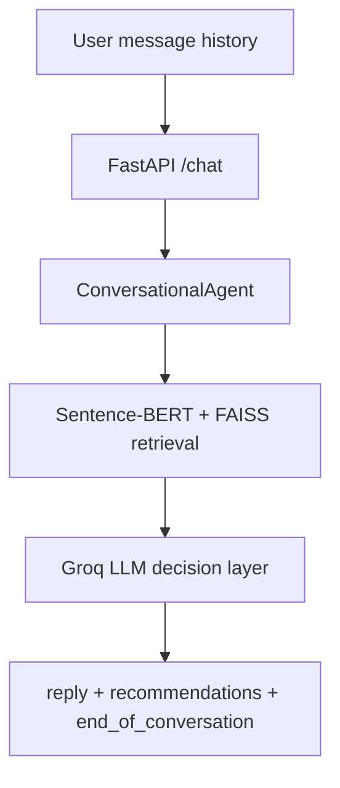

# SHL Conversational Assessment Recommender

Conversational SHL assessment recommender built for the SHL AI Intern take-home assignment.

It exposes the required stateless FastAPI interface, uses Sentence-BERT plus FAISS for grounded retrieval, and uses Groq for shortlist reasoning. The catalog is filtered to in-scope individual SHL solutions and excludes packaged Job Solutions.

## What It Does

- Accepts full conversation history on every `POST /chat` call
- Clarifies vague requests before recommending
- Returns a grounded shortlist with catalog URLs only
- Supports refinement, comparison, and refusal behavior
- Aligns with the evaluator's 8-message total cap across user and assistant turns
- Produces an exact final top-10 shortlist when recommendations are returned

## Architecture



Runtime flow:

1. Build a retrieval query from the accumulated user turns.
2. Retrieve the top 24 grounded candidates from the SHL catalog with FAISS.
3. Ask the LLM to choose the next action: clarify, recommend, refine, compare, confirm, or refuse.
4. Convert the selected names back into strict API response objects.
5. Fall back to FAISS-only heuristics if the LLM is unavailable.

## API Contract

### `GET /health`

```json
{"status": "ok"}
```

### `POST /chat`

Request:

```json
{
  "messages": [
    {"role": "user", "content": "I am hiring a Java developer"},
    {"role": "assistant", "content": "What seniority level?"},
    {"role": "user", "content": "Mid-level, around 4 years"}
  ]
}
```

Response:

```json
{
  "reply": "Here are 10 assessments that fit the brief.",
  "recommendations": [
    {"name": "Java 8 (New)", "url": "https://www.shl.com/...", "test_type": "K"},
    {"name": "Occupational Personality Questionnaire OPQ32r", "url": "https://www.shl.com/...", "test_type": "P"}
  ],
  "end_of_conversation": false
}
```

Notes:

- `recommendations` is empty while the agent is clarifying, comparing, or refusing.
- Any returned shortlist is capped at 10 items.
- `end_of_conversation` becomes `true` on explicit confirmation or when the final turn budget is reached.

## Project Structure

```text
SHL_Assignment/
|-- api/
|   `-- main.py
|-- data/
|   |-- cleaned_catalog.json
|   |-- embeddings.npy
|   `-- faiss_index.bin
|-- evaluation/
|   |-- evaluate.py
|   `-- test_conversations.json
|-- scripts/
|   |-- build_index.py
|   `-- preprocess.py
|-- src/
|   |-- agent.py
|   |-- config.py
|   |-- data_loader.py
|   |-- embedder.py
|   |-- models.py
|   `-- recommender.py
|-- ui/
|   `-- app.py
|-- Dockerfile
|-- docker-compose.yml
|-- requirements.txt
`-- shl_product_catalog.json
```

## Local Setup

```bash
pip install -r requirements.txt
copy .env.example .env
```

Add your Groq key:

```env
GROQ_API_KEY=your_key_here
```

Build the local artifacts:

```bash
python scripts/preprocess.py
python scripts/build_index.py
```

Run the API:

```bash
python -m uvicorn api.main:app --reload --port 8000
```

Run the Streamlit demo:

```bash
streamlit run ui/app.py
```

## Evaluation

The repo includes 10 public conversation traces and a local `Recall@10` evaluator:

```bash
python evaluation/evaluate.py
```

The local evaluator now mirrors the assignment more closely:

- stateless replay
- stop once a shortlist is returned
- respect the 8-message total conversation cap

## Deployment

Recommended split:

- Deploy `FastAPI` for the assignment endpoint
- Deploy `Streamlit` as the demo UI only

Why:

- SHL's automated scorer hits the API, not the Streamlit frontend
- Streamlit is excellent for recruiter demos and manual review
- Keeping the API separate is cleaner and more production-like

## Docker

The repo includes:

- `Dockerfile` for the FastAPI service
- `docker-compose.yml` for local multi-service setup

Docker is not mandatory for the assignment score, but it is a useful plus for portability and recruiter review.
