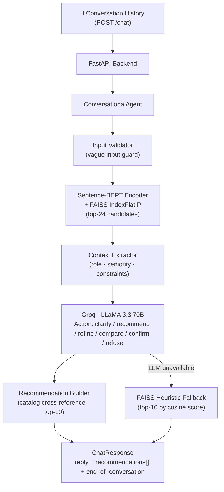

# SHL Conversational Assessment Recommender

A conversational AI system that guides hiring teams to the right SHL assessments through natural multi-turn dialogue. Built on a RAG pipeline combining Sentence-BERT semantic retrieval with LLM-powered shortlist reasoning.

---

## Architecture



**Runtime flow:**
1. Validate input — greetings and off-topic messages are intercepted before the LLM is invoked
2. Embed the accumulated user query using Sentence-BERT and search the FAISS index for the top-24 catalog candidates
3. Extract established context (role, seniority, constraints) from conversation history
4. Send the candidates + context to LLaMA 3.3 70B (Groq) and receive a structured JSON action
5. Cross-reference selected assessment names against the catalog and build the API response
6. On LLM failure — fall back to FAISS cosine-score ordering (system never returns 5xx)

---

## Key Design Decisions

| Component | Choice | Rationale |
|---|---|---|
| **Retrieval** | FAISS `IndexFlatIP` | Exact nearest-neighbor search; <1 ms at 370 vectors; no infrastructure overhead |
| **Embedding** | `all-MiniLM-L6-v2` | Best speed/accuracy ratio for semantic similarity; L2-normalized → inner product = cosine |
| **LLM** | LLaMA 3.3 70B via Groq | ~200 tok/s; GPT-4o-level instruction following; `json_object` response mode for guaranteed valid JSON |
| **API** | FastAPI (stateless) | Full conversation history sent on every call; horizontally scalable; Pydantic enforces the exact evaluator schema |
| **Fallback** | FAISS heuristic | If Groq is rate-limited or unavailable, top-10 by cosine score are returned — zero downtime |
| **UI** | Streamlit | Rapid Python-native interface; `@st.cache_resource` loads the agent once across all sessions |

---

## API Reference

### `GET /health`

```json
{ "status": "ok" }
```

### `POST /chat`

**Request** — full conversation history, stateless:

```json
{
  "messages": [
    { "role": "user",      "content": "I am hiring a senior Java developer with AWS experience." },
    { "role": "assistant", "content": "What seniority level and team size are you targeting?" },
    { "role": "user",      "content": "Mid-senior, around 4–6 years." }
  ]
}
```

**Response:**

```json
{
  "reply": "Based on your requirements, here are 10 SHL assessments that fit the brief.",
  "recommendations": [
    { "name": "Java 8 (New)",                              "url": "https://www.shl.com/...", "test_type": "K" },
    { "name": "Occupational Personality Questionnaire OPQ32r", "url": "https://www.shl.com/...", "test_type": "P" }
  ],
  "end_of_conversation": false
}
```

**Assessment type codes:**

| Code | Category |
|---|---|
| K | Knowledge & Skills |
| P | Personality & Behavior |
| A | Ability & Aptitude |
| C | Competencies |
| S | Simulations |
| E | Assessment Exercises |
| D | Development & 360° |
| B | Biodata & Situational Judgment |

**Behavior:**
- `recommendations` is empty while the agent is clarifying, comparing, or refusing
- Returned shortlists are always capped at 10 items with catalog-verified URLs
- `end_of_conversation` is `true` when the user confirms the final shortlist

---

## Project Structure

```
SHL_Assignment/
├── api/
│   └── main.py              # FastAPI app — /health and /chat endpoints
├── src/
│   ├── agent.py             # ConversationalAgent — RAG pipeline + action routing
│   ├── config.py            # Environment variables, model/retrieval constants
│   ├── data_loader.py       # Catalog ingestion and cleaning
│   ├── embedder.py          # Sentence-BERT encoding + FAISS index management
│   ├── models.py            # Pydantic schemas (ChatRequest, ChatResponse, RecommendationItem)
│   └── recommender.py       # Standalone retrieval utility
├── ui/
│   └── app.py               # Streamlit conversational interface
├── data/
│   ├── cleaned_catalog.json # Preprocessed SHL catalog
│   ├── embeddings.npy       # Pre-computed assessment embeddings
│   └── faiss_index.bin      # Serialized FAISS index
├── scripts/
│   ├── preprocess.py        # Catalog cleaning script
│   └── build_index.py       # Embedding + FAISS index builder
├── evaluation/
│   ├── evaluate.py          # Recall@10 / MAP evaluator
│   └── test_conversations.json
├── Dockerfile
├── docker-compose.yml
└── requirements.txt
```

---

## Local Setup

**1. Install dependencies**

```bash
pip install -r requirements.txt
```

**2. Configure environment**

```bash
copy .env.example .env
```

Add your Groq API key to `.env`:

```env
GROQ_API_KEY=your_key_here
```

**3. Build the FAISS index**

```bash
python scripts/preprocess.py
python scripts/build_index.py
```

**4. Start the API server**

```bash
python -m uvicorn api.main:app --reload --port 8000
```

**5. Launch the Streamlit interface**

```bash
streamlit run ui/app.py
```

The Streamlit UI can connect to the local FastAPI server or run standalone using the built-in agent directly.

---

## Evaluation

The repo includes 10 conversation traces and a local evaluator that mirrors the assignment protocol:

```bash
python evaluation/evaluate.py
```

Metrics computed:
- **Recall@10** — fraction of relevant assessments captured in the shortlist
- **MAP** — mean average precision, accounting for ranking quality

The evaluator replays conversations statelessly, stops once a shortlist is returned, and respects the 8-message conversation cap.

---

## Docker

A `Dockerfile` and `docker-compose.yml` are included for containerized deployment.

```bash
docker compose up --build
```

The FastAPI service runs on port `8000`. The FAISS index is built at container startup if the `data/` artifacts are not already present.

---

## Tech Stack

- **[FastAPI](https://fastapi.tiangolo.com/)** — async REST API with automatic schema validation
- **[Sentence-Transformers](https://www.sbert.net/)** — `all-MiniLM-L6-v2` for semantic embeddings
- **[FAISS](https://github.com/facebookresearch/faiss)** — Facebook AI Similarity Search for vector retrieval
- **[Groq](https://groq.com/)** — high-throughput inference for LLaMA 3.3 70B
- **[Streamlit](https://streamlit.io/)** — conversational web interface
- **[Pydantic v2](https://docs.pydantic.dev/)** — strict request/response schema enforcement
